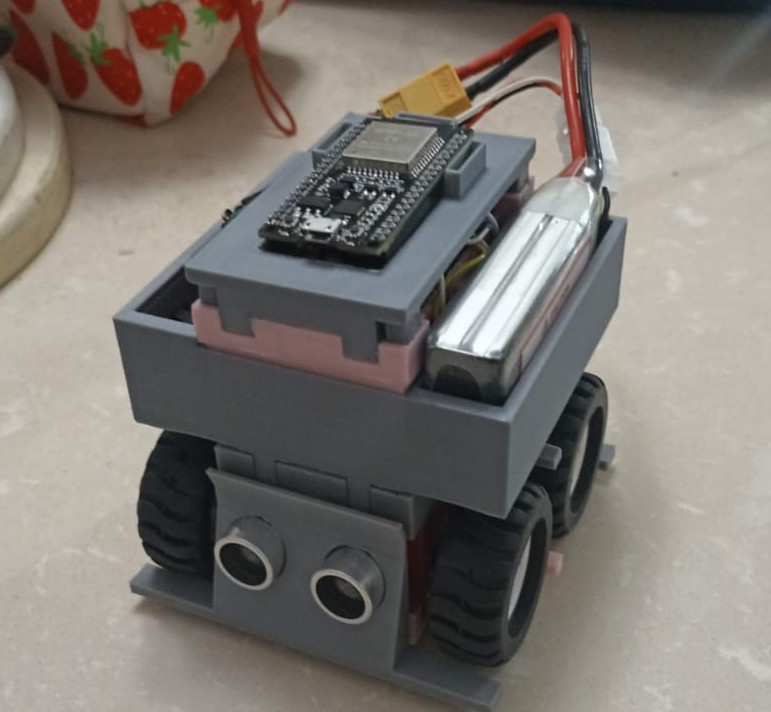

# Robot Sumo Bidireccional - ESP32-S3

**Stack Tecnológico:**
   

**Entorno de Desarrollo:**
    

Este proyecto implementa el firmware completo y la integración de hardware de un robot de sumo competitivo de categoría Mini Sumo (10 cm x 10 cm, sin límite de altura). El diseño del robot es **bidireccional**, permitiéndole atacar y defenderse de manera eficaz sin necesidad de girar sobre su propio eje ante ataques por la retaguardia.

El sistema toma decisiones en tiempo real mediante una máquina de estados ejecutada sobre el RTOS FreeRTOS, procesando datos de múltiples sensores y controlando un sistema de tracción en las 4 ruedas. El código base ha sido migrado a **ESP-IDF v6**, utilizando una arquitectura modular basada en componentes y el sistema de construcción nativo `idf.py`.

### Características principales del Software

| Característica | Detalle |
|---|---|
| Procesamiento Dual | ESP32-S3 (Cerebro Táctico) + STM32G474RET6 (Músculo/Bare-Metal) |
| Lenguajes & Frameworks | C/C++ nativo sobre ESP-IDF 6.x (FreeRTOS) + STM32 LL / HAL |
| Herramienta de build | idf.py / CMake / STM32CubeMX |
| Comunicación I2C | Lectura de 6 sensores ToF vía DMA en el ESP32 sin bloqueo de CPU. |
| Comunicación SPI | "Bus de la Verdad" operando vía DMA para comandos inter-MCU de latencia cero. |
| Control de motores | Delegado al STM32. TIM1/TIM6 gestionan 4 drivers DRV8874 con ADC IPROPI. |
| Conectividad (ESP32) | WiFi + MQTT + mDNS + SmartConfig + OTA (Desactivados en combate) |
| Robustez | Watchdog (WDT), Timeout I2C (Hardware 5ms) y Kill-Switch analógico (22ns). |

---

## Resultados del Prototipo V1



El ensamblaje inicial V1 con tracción a 100 RPM sirvió como validación mecánica y de distribución de componentes. Sin embargo, al iniciar la fase de energización, el sistema presentó fallos de hardware críticos inmediatos:

- **Diagnóstico:** El uso de cableado no dedicado impidió un aislamiento adecuado entre las etapas de potencia de la batería y la lógica de control. Se detectaron riesgos inminentes de cortocircuito general antes de poder validar el firmware en movimiento.
- **Decisión Técnica:** En lugar de forzar parches sobre un hardware frágil, se abortó la etapa de pruebas dinámicas del primer prototipo por seguridad y fiabilidad.
- **Lección Aprendida:** Comprendí que el software más optimizado es inútil sobre un hardware inestable. Para competir de forma segura, es mandatorio diseñar circuitos impresos (PCBs) que aíslen el ruido de los motores, manejen corrientes altas sin riesgo térmico y aseguren la integridad de las señales.

---

## 🚀 Evolución a la Versión V2 (Arquitectura Híbrida en PCB)

A raíz de los hallazgos del primer prototipo, el proyecto pivotó hacia un diseño profesional en PCB y una arquitectura de hardware distribuida. Esta separación previene que la etapa de tracción comprometa al procesador principal:

- **Arquitectura Dual Inter-MCU:** Implementación de bus SPI de alta velocidad entre el ESP32-S3 y el STM32G474RET6, operando estrictamente por DMA con empaquetado de structs en C/C++.
- **Actualización de etapa de potencia:** Uso de drivers DRV8874, aprovechando el pin IPROPI para lectura analógica de corriente (muestreo continuo vía ADC con DMA en el STM32) para detección predictiva de stall y ajuste dinámico de torque.
- **Migración del regulador lógico:** A AP64203.
- **Corrección de interrupción:** Ruteo del pin de interrupción unificada de los VL53L1X hacia el GPIO1.
- **Delegación total del control de tracción:** Coprocesador STM32G474RET6, operando estrictamente en Bare-Metal (Low Layer). Uso de TIM1 para PWM y TIM6 con Lookup Tables para rampas de aceleración asíncronas.
- **Frenado activo de latencia cero (nanosegundos):** Ruteando los TCRT5000 directamente a los comparadores analógicos internos del STM32 vinculados al TIM1_BRK.
- **Telemetría diferida real:** Almacenamiento de logs en PSRAM en pleno combate y volcado asíncrono a LittleFS/MQTT comandado por botones físicos de Victoria/Derrota.
- **Inyección de configuración en caliente:** Despliegue de una red local (Access Point) generada por el ESP32 para inyección de configuraciones en caliente al NVS al entrar en modo de prueba.

---

## Especificaciones de Hardware (Actual)

* **Arquitectura:** Híbrida Asimétrica.
* **Cerebro Táctico:** ESP32-S3 (ESP-IDF, FreeRTOS, SMP). Gestiona estrategia y orquestación.
* **Músculo y Reflejos:** STM32G474RET6 operando en Bare-Metal/HAL.
* **Tracción:** 4 Motores Pololu N20 de **1000 RPM**.
* **Control de Potencia:** 4 Drivers DRV8874 independientes.
* **Detección de Rival (ToF):** 6 Sensores de Tiempo de Vuelo 3 frontales, 3 traseros. Transmisión I2C con DMA a 400kHz.
* **Reacción de Borde:** Comparadores analógicos ruteados internamente al TIM1_BRK del STM32.
* **Comunicación Inter-MCU:** (SPI Esclavo + DMA). Transferencias sin bloqueo usando empaquetado de memoria de 1-byte.
* **Alimentación:** Batería LiPo 2s 2200mAh 50C, gestionada por BMS (20A).
* **Regulación Lógica:** AP64203.

---

## Optimización Real-Time

El sistema integra optimizaciones de bajo nivel para garantizar un rendimiento Hard Real-Time en combate:

1. **Reacción de Baja Latencia (Bypass de Software):** La detección de los bordes del tatami utiliza el módulo MCPWM Fault del ESP32-S3 para clavar los frenos a nivel de hardware, reduciendo significativamente la carga de CPU. Simultáneamente, una interrupción despierta a la Máquina de Estados asíncronamente mediante `xTaskNotifyWait`, asegurando una evasión rápida sin causar inanición a otras tareas.
2. **Concurrencia Lock-Free (Control de Motores):** La transferencia de setpoints de velocidad desde la estrategia hacia los generadores PWM se realiza mediante **Bit-Packing atómico** (`std::atomic<uint32_t>`). Esto evita el uso de bloqueos (Mutex/Spinlocks) en FreeRTOS.
3. **Empaquetado Estricto de Memoria:** El sistema de comunicación y telemetría utiliza estructuras con empaquetado forzado a 1 byte (`#pragma pack(push, 1)`) para prevenir corrupción de memoria por desalineación introducida por el compilador.

---

## Arquitectura del Software

El firmware utiliza al máximo las capacidades del ESP32-S3 mediante múltiples tareas FreeRTOS supervisadas por un **Task Watchdog (WDT)**. El sistema implementa una lógica de reinicio rápido en caso de fallo, omitiendo esperas innecesarias para reincorporarse al combate al instante.

```text
ESP32-S3 (Core 0)              ESP32-S3 (Core 1)              STM32G474 (Bare-Metal)
──────────────────────         ──────────────────────         ──────────────────────
Matriz ToF I2C (Prio: 10)      Máquina de Estados (Prio: 5)   Control Motores (TIM1/TIM6)
Bus SPI DMA (Prio: 10)         Interrupciones (Prio: 3)       ADC IPROPI (Corriente)
Telemetría/Logs (Prio: 1)                                     Interrupciones Borde (22ns)
Audio/Musica (Prio: 1)
```

### Módulos por Componentes (ESP32-S3)

- **`core`** — El corazón táctico.
    - **`MaquinaEstados`**: Lógica central de toma de decisiones.
    - **Estrategias:** Implementa un **Patrón Strategy** polimórfico (`EstrategiaBase`, `EstrategiaEstandar`, `Estrategia1`, `Estrategia2`).
    - **`GestorI2C`**: Arquitectura de bus I2C con autorrecuperación en caso de fallos.
    - **`GestorBorde`**: Procesamiento de interrupciones asíncronas para reacciones de supervivencia.
    - **`Nvs`**: Abstracción persistente para configuración táctica.
- **`actuadores`** — Delegación de potencia.
    - **`Velocidades`**: Estructuras y empaquetado de setpoints cinéticos transmitidos vía SPI DMA hacia el STM32.
- **`sensores`** — Drivers de percepción.
    - **`SensorTof`**: Driver de la matriz ToF (I2C DMA) para localización de alta velocidad del oponente.
- **`comunicaciones`** — Gestión del SPI DMA ("Bus de la Verdad") activo en combate. Stack inalámbrico (WiFi, MQTT, OTA, mDNS) desactivado durante asaltos.
- **`ui` / `configuracion` / `Musica`** — Gestión de LED RGB, pines/eventos y tonos.

### Coprocesador STM32G474 (Bare-Metal)
- **`TIM1` / `TIM6`**: PWM de tracción y Lookup Tables para curvas de aceleración asíncronas.
- **`ADC (IPROPI)`**: Sensado de corriente para detección predictiva de stall (atasco).
- **`Comparadores`**: "Kill-Switch" analógico para sensores de línea ruteados a `TIM1_BRK` (~22ns).

---

## Modos de Operación

| Modo | Descripción | Activación |
|---|---|---|
| `0` | **Prueba / Telemetría** — Activa WiFi y MQTT. Permite monitoreo y ajustes en tiempo real. | Mantener presionado el botón al encender. |
| `1` | **Combate Autónomo** — Modo competitivo estricto. Transmisión inalámbrica desactivada para máximo rendimiento. | Encendido normal (Por defecto). |

---

## Parámetros Ajustables (NVS)

Las variables tácticas críticas se pueden ajustar remotamente:

| Clave NVS | Descripción |
|---|---|
| **Tiempos y Estrategia (NVS: tiempos)** | |
| `estrategia` | Algoritmo inicial seleccionado. |
| `tof_corto_plazo` / `tof_largo_plazo` | Ventanas de filtrado anti-jitter para ToFs. |
| `recta_star` / `giro_star` | Tiempos de maniobra inicial (Estrategia Star). |
| `t_stall` | Tiempo límite de corriente máxima antes de abortar. |
| **Velocidades (NVS: motores)** | |
| `tiempo_rampa` | Aceleración progresiva de los motores (ms) enviada al STM32. |
| `velocidad_nI` / `nD` | Velocidad Normal (Búsqueda). |
| `velocidad_aI` / `aD` | Velocidad de Ataque. |
| `velocidad_mI` / `mD` | Velocidad Maxima. |
| `velocidad_pI` / `pD` | Velocidad de giro pronunciado. |
| `velocidad_gI` / `gD` | Velocidad de Giro. |
| `velocidad_hI` / `hD` | Velocidad de huida. |

---

## Ecosistema de Herramientas

- 🐍 **`telemetria.py`**: Middleware en Python para análisis de datos y almacenamiento en base de datos local SQLite persistente. Extrae logs post-asalto para no penalizar el loop de control ni afectar la latencia del robot.
- 📜 **`commit.py`**: Script de automatización que inyecta el hash del commit para trazabilidad del firmware.
- 📦 **`full_codebase.sh`**: Utilidad para el mantenimiento y empaquetado del repositorio.

---

## Estructura del Proyecto

```text
├── esp32-s3/                   # Cerebro Táctico (ESP-IDF v6)
│   ├── components/
│   │   ├── actuadores/         # Estructuras de payload cinético (Velocidades)
│   │   ├── comunicaciones/     # Driver SPI (Bus de la Verdad), WiFi, MQTT, OTA
│   │   ├── configuracion/      # Pines y Eventos
│   │   ├── core/               # Máquina de estados, Estrategias y NVS
│   │   ├── sensores/           # Drivers matriz ToF (I2C DMA)
│   │   ├── ui/                 # LED RGB (Interfaz centralizada)
│   │   └── Musica/             # Buzzer
│   ├── main/main.cpp           # Punto de entrada e inicialización
│   ├── partitions_s3.csv       # Tabla de particiones NVS
│   └── sdkconfig               # Configuración FreeRTOS/ESP32
├── stm32g4/                    # Músculo y Reflejos (Bare-Metal)
│   ├── Core/
│   │   ├── Inc/                # Cabeceras (LL predominante, HAL, main.h)
│   │   └── Src/                # Controladores TIM1/TIM6, ADC IPROPI y main.c
│   ├── Drivers/                # CMSIS y STM32G4xx_HAL_Driver
│   └── stm32g4.ioc             # Configuración de STM32CubeMX
```

---

## Compilación y Flasheo

### Cerebro Táctico (ESP32-S3)
```bash
cd esp32-s3/
# Limpiar y compilar
idf.py fullclean build
# Flashear y monitorear
idf.py -p [PUERTO] flash monitor
```

### Coprocesador Muscular (STM32G474)
```bash
cd stm32g4/
# Compilar proyecto vía CMake
cmake --build build/Debug

# Generar binario (.bin) a partir del ELF
arm-none-eabi-objcopy -O binary build/Debug/*.elf build/Debug/firmware.bin

# Flashear vía STM32CubeProgrammer (Protocolo Oficial SWD)
STM32_Programmer_CLI -c port=SWD mode=UR -w build/Debug/*.elf -v -rst

# Flashear vía st-link (Alternativa Open Source)
st-flash --reset write build/Debug/*.bin 0x8000000
```
